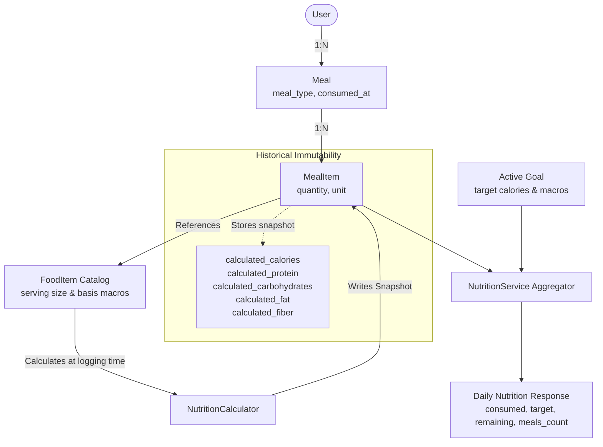
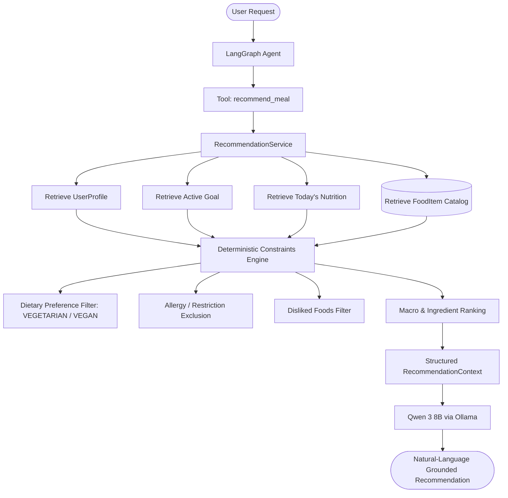

# Nutrino - AI Nutrition & Meal Planning Agent

[](https://www.python.org/)
[](https://fastapi.tiangolo.com/)
[](https://www.postgresql.org/)
[](https://www.sqlalchemy.org/)
[](LICENSE)

A production-grade, agentic AI nutrition and meal planning platform. Unlike simple chatbot wrappers, Nutrino strictly separates natural-language reasoning (orchestrated via LangGraph and local Ollama inference) from authoritative, deterministic application logic and nutritional calculations.

---

## 1. Project Overview

Nutrino allows users to converse naturally about their food intake (e.g., *"I had 2 dosas with sambar and one coffee for breakfast"* or *"What should I eat for dinner?"*). 

### Core Architectural Principle
**The LLM is NOT the source of truth for nutrition calculations or database mutations.**

- **AI Responsibilities**: Natural language understanding, intent recognition, structured food and entity extraction, tool selection, and contextual reasoning over application data.
- **Application Responsibilities**: Strict input validation (Pydantic), business rules, deterministic nutrition computations (macronutrients, micronutrients, target deltas), database operations, and user authorization.
- **Database Responsibilities**: The PostgreSQL database remains the single authoritative persistent state of the system.


---

## 2. Technology Stack

### Backend
- **Language**: Python 3.12
- **Framework**: FastAPI (asynchronous REST API, auto OpenAPI documentation)
- **Data Validation & Settings**: Pydantic v2 & Pydantic-Settings
- **ORM & Migrations**: SQLAlchemy 2.x & Alembic
- **Database**: PostgreSQL 16+
- **Security**: JWT Authentication (HS256) with passlib / bcrypt
- **Testing**: pytest, pytest-asyncio, httpx

### AI & Agent Layer (Phases 6–8)
- **Local LLM Inference**: Ollama (local server running on host)
- **Model**: Qwen 2.5 7B / Qwen 3 8B
- **Agent Orchestration**: LangGraph state graph with deterministic tool calling

### Frontend (Phase 10)
- React with Vite, JavaScript, Tailwind CSS, Axios

### Infrastructure
- Docker & Docker Compose
- Native Linux development compatibility

---

## 3. Architecture & Project Layout

```
Nutrino/
├── .env.example                # Environment variables template
├── .gitignore                  # Git ignore rules
├── docker-compose.yml          # PostgreSQL & Backend multi-container setup
├── README.md                   # Project documentation
├── alembic.ini                 # Root Alembic configuration
└── backend/
    ├── Dockerfile              # Production-grade Python 3.12 container
    ├── requirements.txt        # Pinned dependencies
    ├── alembic.ini             # Backend Alembic configuration
    ├── alembic/                # Alembic database migrations
    │   ├── env.py
    │   ├── script.py.mako
    │   └── versions/
    ├── app/
    │   ├── main.py             # FastAPI entry point & lifespan management
    │   ├── api/                # API routing
    │   │   └── v1/
    │   │       ├── api.py      # v1 router aggregator
    │   │       └── endpoints/
    │   │           ├── agent.py        # Agent conversational chat endpoint (Phase 8)
    │   │           ├── ai.py           # Development AI entity extraction endpoint
    │   │           ├── auth.py
    │   │           ├── food.py
    │   │           ├── goals.py
    │   │           ├── health.py
    │   │           ├── meals.py        # Meal logging, retrieval, deletion
    │   │           ├── nutrition.py    # Daily & historical aggregation
    │   │           ├── profile.py
    │   │           └── recommendations.py # Direct recommendations endpoint (Phase 9)
    │   ├── agent/                  # LangGraph Agent Orchestration (Phase 8)
    │   │   ├── __init__.py         # Package exports
    │   │   ├── graph.py            # Compiled LangGraph StateGraph
    │   │   ├── nodes.py            # agent_node, tool_execution_node, should_continue
    │   │   ├── prompts.py          # Dedicated system prompt & structured schemas
    │   │   ├── runtime.py          # Non-serializable AgentRuntimeContext
    │   │   ├── schemas.py          # Agent chat request/response models
    │   │   ├── service.py          # AgentService execution coordinator
    │   │   └── state.py            # Explicit typed AgentState definition
    │   ├── recommendations/        # Personalized Nutrition Recommendations (Phase 9)
    │   │   ├── __init__.py         # Package exports
    │   │   ├── constraints.py      # Deterministic dietary, allergy, & ranking filters
    │   │   ├── prompts.py          # Recommendation system prompts
    │   │   ├── schemas.py          # FoodCandidate, RecommendationContext schemas
    │   │   └── service.py          # RecommendationService business logic
    │   ├── config/                 # Pydantic Settings configuration
    │   │   └── settings.py
    │   ├── database/               # Engine, sessions, Base model, seeds
    │   │   ├── base.py
    │   │   ├── seed.py
    │   │   └── session.py
    │   ├── auth/                   # Security, password hashing, JWT, dependencies
    │   │   ├── dependencies.py
    │   │   └── security.py
    │   ├── exceptions/             # Centralized error handling
    │   │   ├── base.py
    │   │   └── handlers.py
    │   ├── llm/                    # Local LLM abstraction layer (Ollama + Qwen 3 8B)
    │   │   ├── client.py           # Non-blocking async Ollama transport
    │   │   ├── exceptions.py       # Connection, timeout, and parsing errors
    │   │   ├── prompts.py          # Strict extraction prompts & schemas
    │   │   ├── schemas.py          # Pydantic structured output models
    │   │   └── service.py          # LLM inference & schema validation service
    │   ├── models/                 # SQLAlchemy ORM models
    │   │   ├── base.py
    │   │   ├── food.py
    │   │   ├── goal.py
    │   │   ├── meal.py             # Meal and MealItem models
    │   │   ├── profile.py
    │   │   └── user.py
    │   ├── nutrition/              # Deterministic nutrition calculator
    │   │   └── calculator.py
    │   ├── schemas/                # Pydantic request/response schemas
    │   │   ├── auth.py
    │   │   ├── food.py
    │   │   ├── goal.py
    │   │   ├── health.py
    │   │   ├── meal.py             # Meal & MealItem request/response schemas
    │   │   ├── nutrition.py        # Daily & Historical nutrition schemas
    │   │   ├── profile.py
    │   │   └── user.py
    │   ├── tools/                  # Controlled agent tools & registry (Phases 7 & 9)
    │   │   ├── base.py             # BaseTool, ToolContext, and ToolResult
    │   │   ├── food_tools.py       # Catalog search & food item lookup tools
    │   │   ├── goal_tools.py       # User active goal retrieval tool
    │   │   ├── meal_tools.py       # Meal creation, lookup, and deletion tools
    │   │   ├── nutrition_tools.py  # Daily & historical aggregation tools
    │   │   ├── profile_tools.py    # User dietary profile retrieval tool
    │   │   ├── recommend_tools.py  # Controlled recommend_meal tool (Phase 9)
    │   │   ├── registry.py         # Central ToolRegistry (12 registered tools)
    │   │   └── schemas.py          # Input/output schemas for tool parameters
    │   └── services/               # Decoupled business logic & queries
    │       ├── food_service.py
    │       ├── goal_service.py
    │       ├── meal_service.py     # Meal CRUD & atomic transactions
    │       ├── nutrition_service.py # Aggregation & target comparison
    │       ├── profile_service.py
    │       └── user_service.py
    └── tests/                      # Pytest automated test suite (153 tests)
        ├── conftest.py
        ├── test_agent.py               # LangGraph agent orchestration tests
        ├── test_ai_llm.py              # LLM extraction & error handling tests
        ├── test_auth.py
        ├── test_database.py
        ├── test_food.py
        ├── test_goals.py
        ├── test_health.py
        ├── test_historical_snapshot.py # Snapshot immutability tests
        ├── test_meals.py               # Meal logging & transaction tests
        ├── test_nutrition_agg.py       # Daily & historical aggregation tests
        ├── test_nutrition_calc.py
        ├── test_profile.py
        ├── test_recommendations.py     # Personalized recommendation tests
        └── test_tools.py               # Controlled tools & registry tests
```

---

## 4. Current Implementation Status (Phases Roadmap)

- [x] **Phase 1: Foundation**
  - Project directory structure and Git setup
  - FastAPI application with lifespan management and CORS middleware
  - Pydantic Settings environment configuration (`.env.example`, `.env`)
  - PostgreSQL connectivity, engine connection pooling, and session management
  - SQLAlchemy 2.x declarative base and TimestampMixin
  - Alembic migrations configuration (`env.py`, `script.py.mako`)
  - Centralized exception handlers preventing stack trace leakage
  - Health check endpoints (`/api/v1/health`, `/live`, `/ready`)
  - Docker & Docker Compose configuration
  - Unit and integration tests with pytest (100% pass)
- [x] **Phase 2: Authentication & User Management**
  - SQLAlchemy 2.x `User` model with unique constraint, indexing, and timestamps
  - Pydantic v2 schemas (`UserCreate`, `UserResponse`, `UserLogin`, `Token`, `TokenPayload`)
  - Secure bcrypt password hashing with `passlib`
  - Cryptographic JWT access-token generation and decoding (`sub`, `iat`, `exp`)
  - Decoupled `UserService` for user registration, duplicate email checks, and verification
  - `POST /api/v1/auth/register` (201 Created)
  - `POST /api/v1/auth/login` (200 OK)
  - `get_current_user` FastAPI dependency resolving user from Bearer JWT
  - `GET /api/v1/auth/me` protected endpoint
  - Alembic migration `7e37a9222572_create_users_table.py` applied
  - Automated tests covering registration, login, wrong password, duplicate emails, invalid data, expired/invalid tokens (20/20 passed)
- [x] **Phase 3: User Context (Profile & Goals)**
  - SQLAlchemy 2.x `UserProfile` model (1:1 with `User`, cascade delete, PostgreSQL native `JSON` array storage for preferences/restrictions/ingredients)
  - SQLAlchemy 2.x `Goal` model (user objective, target calories, protein, carbs, fat, notes)
  - Pydantic v2 schemas for Profile (`UserProfileBase`, `UserProfileCreate`, `UserProfileUpdate`, `UserProfileResponse`) and Goal (`GoalType`, `GoalBase`, `GoalCreate`, `GoalUpdate`, `GoalResponse`)
  - Decoupled `ProfileService` and `GoalService` with idempotent upsert operations
  - `GET /api/v1/profile` & `PUT /api/v1/profile` endpoints
  - `GET /api/v1/goals` & `PUT /api/v1/goals` endpoints
  - User isolation strictly enforced (only access and modify own context)
  - Alembic migration `85d04c028d5e_create_user_profiles_and_goals_tables.py` applied
  - Full automated tests covering profile and goal creation, updates, partial updates, validation, authentication, and user isolation (33/33 passed)
- [x] **Phase 4: Nutrition Data & Food Items**
  - SQLAlchemy 2.x `FoodItem` model with PostgreSQL `NUMERIC(8, 2)` decimal precision, serving definition, categories, and 6 check constraints
  - Decoupled deterministic `NutritionCalculator` service with dimension-safe unit conversions (gram/kg, ml/liter, culinary volumes, pieces/servings)
  - Strict validation preventing unscientific dimension mixing (e.g. piece vs gram without explicit weight)
  - Idempotent database seed script (`app.database.seed`) populating 20 common baseline foods (idli, dosa, sambar, dal, paneer, chicken, etc.) clearly documented as `INTERNAL_DEV_DATASET`
  - Public read-only catalog endpoints: `GET /api/v1/foods/search?q={query}&category={category}` with relevance ranking, and `GET /api/v1/foods/{food_id}`
  - Alembic migration `452b73097c65_create_food_items_table.py` applied
  - Full automated test suite (53/53 tests passed)
- [x] **Phase 5: Meal System & Deterministic Aggregation**
  - SQLAlchemy 2.x `Meal` and `MealItem` models with cascade deletion and indexing (`user_id, consumed_at`)
  - Historical Nutrition Snapshot architecture: `MealItem` preserves immutable calculated calories and macronutrients captured at logging time
  - Fully atomic meal creation: in-memory pre-validation of all items, unit compatibility checks via `NutritionCalculator`, and complete transaction rollback on any invalid item
  - Decoupled `MealService` and `NutritionService` cleanly isolating business logic from endpoints
  - Deterministic Daily Nutrition aggregation comparing consumed macros against active user `Goal` targets with non-negative remaining targets: `remaining = max(0, target - consumed)`
  - Safe zero-meal response returning 200 OK with zero totals rather than 404
  - Historical nutrition aggregation endpoint bounded to a maximum 31-day range
  - Endpoints: `POST /api/v1/meals`, `GET /api/v1/meals`, `GET /api/v1/meals/today`, `GET /api/v1/meals/{meal_id}`, `DELETE /api/v1/meals/{meal_id}`, `GET /api/v1/nutrition/today`, `GET /api/v1/nutrition`, `GET /api/v1/nutrition/history`
  - Alembic migration `092cbe7f6fec_create_meals_and_meal_items_tables.py` applied
  - Comprehensive test suite (71/71 tests passing)
- [x] **Phase 6: Local LLM Integration (Ollama + Qwen 3 8B)**
  - Isolated Local LLM abstraction (`app.llm`) decoupling Ollama communication from the REST API and database
  - Local inference using `qwen3:8b` via Ollama (`0.35.1`+), accelerated on Vulkan discrete GPU / host CPU
  - Dedicated non-blocking async `OllamaClient` with configurable timeout (`OLLAMA_TIMEOUT_SECONDS`), connection failure handling, and `think: False` control
  - Pydantic v2 structured output schemas (`ExtractedMealItem`, `MealExtraction`) enforcing strict entity extraction
  - Strict preservation of ambiguity: unspecified quantities or units remain `None`/`null` without fabricating data
  - Independent development verification endpoint: `POST /api/v1/ai/extract-meal`
  - Zero database mutations: AI extraction does NOT create meals, query tables, or calculate nutrition
  - Offline-safe automated test suite mocking the Ollama boundary (14 tests)
  - Full test suite: 85 passed, 0 failed
- [x] **Phase 7: Controlled Agent Tools**
  - Dedicated `app.tools` package providing safe, deterministic tool interfaces for the agent layer
  - Base interface `BaseTool` with typed Pydantic input/output schemas, JSON schema generation, and `ToolContext`
  - Strict user context derivation: all user-scoped tools derive `user_id` strictly from authenticated backend context, never from LLM inputs
  - Reused existing application services (`FoodService`, `ProfileService`, `GoalService`, `MealService`, `NutritionService`) with zero duplicate business logic
  - 11 registered tools across Food, Profile, Goal, Meal, and Nutrition domains
  - Centralized `ToolRegistry` with tool discovery, schema reflection, and execution dispatch
  - Zero direct database access or raw SQL execution from tools
  - Deterministic nutrition calculations via `NutritionCalculator` and `NutritionService` preserved
  - Unit and integration tests covering all 11 tools, registry dispatch, parameter validation, and user isolation (25 tests)
  - Full test suite: 110 passed, 0 failed
- [x] **Phase 8: LangGraph Agent Orchestration (Current)**
  - Dedicated `app.agent` package providing isolated LangGraph agent orchestration
  - Explicit typed `AgentState` containing message history, tool calls, tool results, and iteration counts
  - Decoupled `AgentRuntimeContext` holding non-serializable DB session, user model, and `ToolContext` (never exposed to LLM or state)
  - Graph topology: `agent_node` <-> `tool_execution_node` with conditional `should_continue` routing
  - Bounded iteration limit (`MAX_AGENT_ITERATIONS = 6`) preventing infinite reasoning loops
  - Dedicated system prompt enforcing zero-fabrication of nutrition numbers/IDs, ambiguous quantity clarification, and food catalog resolution
  - Controlled tool execution boundary executing exclusively against registered tools in `ToolRegistry`
  - Conversational REST API: `POST /api/v1/agent/chat` protected by JWT authentication
  - 21 comprehensive agent tests covering read flows, meal logging, ambiguous quantity, user isolation, iteration limits, error codes (503/504/422)
  - Total test suite: 131 passed, 0 failed
- [ ] **Phase 9: Contextual & Proactive Recommendations**
- [ ] **Phase 10: React Frontend Dashboard**
- [ ] **Phase 11: End-to-End Evaluation & Testing**
- [ ] **Phase 12: CI/CD & Production Packaging**

---

## 5. Domain Architecture: Phase 5 Meal System & Aggregation

### Core Domain Flow & Architecture



### Key Architectural Decisions

#### 1. Nutrition Snapshot Immutability
When a meal is logged, exact nutritional values are computed using `NutritionCalculator` and stored directly on `MealItem`:
- `calculated_calories`, `calculated_protein`, `calculated_carbohydrates`, `calculated_fat`, `calculated_fiber` (PostgreSQL `NUMERIC(8, 2)`).
- **Rationale**: If nutritional definitions in the `FoodItem` catalog are refined or updated in the future, past dietary history must remain factual and uncorrupted.

#### 2. Atomic Transaction Integrity
- When a user logs a multi-item meal, all referenced foods and measurement units are resolved and pre-validated against the food catalog in memory before any database write occurs.
- If even a single item in the meal fails validation (e.g. invalid food ID, incompatible unit, non-positive quantity), the entire database transaction is rolled back. No partial meals are persisted.

#### 3. Timezone Strategy
- All timestamps (`consumed_at`, `created_at`, `updated_at`) are stored in UTC in PostgreSQL (`TIMESTAMP WITH TIME ZONE`).
- The application interprets calendar day boundaries (`/today` and `?date=YYYY-MM-DD`) deterministically from midnight to end-of-day in UTC (`00:00:00.000000Z` to `23:59:59.999999Z`).
- Future phases will allow user-defined profile timezones while keeping the database tier strictly in UTC.

#### 4. Goal Comparison & Target Flooring
- Consumed macronutrients are compared against active user goals.
- Remaining targets are floored at zero: `remaining = max(Decimal('0.00'), target - consumed)`. Over-consumption never produces negative remaining targets.
- Empty days return HTTP 200 with zero totals (`meals_count=0`, `0.00` macros), avoiding unnecessary 404 client errors.

#### 5. User Isolation & Security
- All queries, filters, and mutations are scoped to `user_id` extracted from the authenticated JWT.
- Attempting to view or delete another user's meal yields HTTP 404 (authorization-safe, preventing resource enumeration).

---

## 6. Local LLM Layer: Phase 6 Ollama & Qwen 3 8B Integration

### Overview & Architectural Boundary
Phase 6 introduces a fully isolated Local LLM abstraction (`app.llm`) for natural language understanding and structured food entity extraction.

```
                    Natural Language Input
                            │
                            ▼
             ┌─────────────────────────────┐
             │       Local LLM Layer       │
             │   (OllamaClient + Qwen 3)   │
             └──────────────┬──────────────┘
                            │ Validated via Pydantic
                            ▼
             ┌─────────────────────────────┐
             │   Structured MealExtraction │
             │  (food_name, qty, unit)     │
             └──────────────┬──────────────┘
                            │ (Future Phase 7 & 8 Agent Tools)
                            ▼
             ┌─────────────────────────────┐
             │    Deterministic Domain     │
             │     NutritionCalculator     │
             └──────────────┬──────────────┘
                            ▼
                   PostgreSQL Database
```

#### Strict Architectural Guarantees:
1. **Zero Database Access**: The LLM layer has no access to SQLAlchemy sessions or database models.
2. **Zero Nutrition Fabrication**: The LLM never calculates, estimates, or invents calories or macronutrients.
3. **Preservation of Ambiguity**: If a user says *"I had some rice and vegetables"*, the extractor sets `quantity: null` and `unit: null`. It never guesses or fabricates amounts.
4. **Isolated Transport**: `OllamaClient` communicates asynchronously via Ollama's REST API (`/api/chat`) with `think: false` and enforced JSON formatting.

### Model & Inference Configuration
- **Model**: `qwen3:8b` (8.19B parameters, Q4_K_M quantization)
- **Local Server**: Ollama `0.35.1`+
- **Hardware Acceleration**: Automatically offloads 30 of 36 transformer layers to discrete GPU (e.g. NVIDIA RTX 4050 6 GB VRAM via Vulkan/CUDA) with remaining layers on CPU.

#### Environment Variables
```ini
OLLAMA_BASE_URL="http://localhost:11434"
OLLAMA_MODEL="qwen3:8b"
OLLAMA_TIMEOUT_SECONDS=120.0
```

### Running and Verifying Ollama
1. **Start Ollama Daemon**:
   ```bash
   ollama serve
   ```
2. **Verify Model is Available**:
   ```bash
   ollama list
   # Output should display:
   # NAME        ID              SIZE      MODIFIED
   # qwen3:8b    500a1f067a9f    5.2 GB    ...
   ```
3. **Pull Model (if not present)**:
   ```bash
   ollama pull qwen3:8b
   ```

### Development Verification Endpoint
A standalone testing endpoint is provided for verifying extraction without database mutations:
`POST /api/v1/ai/extract-meal`

#### Example Request:
```bash
curl -X POST http://localhost:8000/api/v1/ai/extract-meal \
  -H "Content-Type: application/json" \
  -d '{"text": "I had 2 idlis and a bowl of sambar for breakfast."}'
```

#### Example Response:
```json
{
  "success": true,
  "extraction": {
    "meal_type": "BREAKFAST",
    "items": [
      {
        "food_name": "idli",
        "quantity": "2",
        "unit": "piece",
        "notes": null
      },
      {
        "food_name": "sambar",
        "quantity": "1",
        "unit": "bowl",
        "notes": null
      }
    ]
  },
  "model": "qwen3:8b"
}
```

---

## 7. Controlled Agent Tools & Registry (Phase 7)

### Overview & Security Boundary
Phase 7 establishes the safe, deterministic tool interface between the future AI agent (LangGraph in Phase 8) and backend application services.

```
                    Natural Language
                           │
                           ▼
                    Qwen 3 8B / Ollama
                           │
                           ▼
                  Future Agent Layer (Phase 8)
                           │
                           ▼
                    Controlled Tools (Phase 7)
                           │
             ┌─────────────┼─────────────┐
             ▼             ▼             ▼
          Food Tools   User Tools    Meal Tools
             │             │             │
             └─────────────┼─────────────┘
                           ▼
                    Existing Services
                           │
                           ▼
                  Deterministic Domain
                    NutritionCalculator
                           │
                           ▼
                       PostgreSQL
```

### Critical Architectural Guarantees:
1. **User Identity from Authentication Only**: User-scoped tools derive the `user_id` strictly from `ToolContext.user_id` (injected via backend authentication), never from arguments passed by the LLM or caller.
2. **Zero Direct Database Access**: Tools do not run queries, execute SQL, or mutate tables directly. All operations adapt existing services (`FoodService`, `ProfileService`, `GoalService`, `MealService`, `NutritionService`).
3. **Deterministic Nutrition Calculations**: Meal creation and daily aggregation tools rely strictly on `NutritionCalculator` and `NutritionService`. The LLM never calculates calories or macronutrients.
4. **No Arbitrary Code or SQL Execution**: No generic command execution, HTTP requests, or raw SQL capabilities are exposed.

### Controlled Tools (11 Registered Tools)
| Domain | Tool Name | Description | Requires Auth |
| :--- | :--- | :--- | :--- |
| **Food** | `search_foods` | Search authoritative food catalog by keyword/category | No |
| **Food** | `get_food` | Retrieve food catalog entry and nutritional baseline by ID | No |
| **Profile** | `get_user_profile` | Retrieve authenticated user's dietary preferences, allergies, and metrics | Yes |
| **Goal** | `get_active_goal` | Retrieve authenticated user's active calorie and macronutrient targets | Yes |
| **Meals** | `create_meal` | Create a meal with food IDs, quantities, and units (calculates snapshots) | Yes |
| **Meals** | `get_today_meals` | Retrieve all meals consumed by the authenticated user today (UTC) | Yes |
| **Meals** | `get_meal` | Retrieve a specific meal by ID (enforces user ownership) | Yes |
| **Meals** | `delete_meal` | Delete a specific meal by ID (enforces user ownership) | Yes |
| **Nutrition** | `get_today_nutrition` | Retrieve today's aggregated intake, active goal targets, and remaining budget | Yes |
| **Nutrition** | `get_nutrition` | Retrieve aggregated intake, targets, and remaining budget for a specific date | Yes |
| **Nutrition** | `get_nutrition_history` | Retrieve daily aggregated history across a date range (max 31 days) | Yes |

### ToolRegistry & Agent Schema Discovery
`ToolRegistry` provides centralized discovery and invocation:
- `tool_registry.list_tools()`: Lists all registered tool identifiers.
- `tool_registry.get_tool_metadata()`: Emits standard JSON Schema parameter specifications ready for LLM tool binding.
- `tool_registry.execute(name, arguments, context)`: Validates input schemas using Pydantic, checks authentication, and executes within `ToolContext`.

---

## 8. LangGraph Agent Orchestration (Phase 8)

### Target Architecture

Phase 8 introduces the first real **LangGraph-based nutrition agent**. The agent receives natural-language input, reasons over user context, invokes controlled backend application tools deterministically, and produces grounded, concise answers.

```text
User Request
     ↓
FastAPI (POST /api/v1/agent/chat)
     ↓
JWT Authentication (Authenticated User)
     ↓
Agent Runtime Context (db, user, ToolContext)
     ↓
LangGraph StateGraph
     ↓
Qwen 3 8B (via Ollama)
     ↓
Tool Selection (Structured JSON)
     ↓
Controlled ToolRegistry (11 Tools)
     ↓
Existing Application Services
     ↓
PostgreSQL
     ↓
Deterministic Tool Result
     ↓
LangGraph Agent Node
     ↓
Qwen 3 8B (Synthesis)
     ↓
Final User Response
```

### Critical Architectural Guarantees:
1. **The LLM Never Accesses the Database Directly**: The model cannot construct SQL, inspect schemas, or directly query PostgreSQL.
2. **The LLM Never Calculates Nutrition**: Nutrition numbers are calculated deterministically by `NutritionCalculator` and stored during meal creation snapshots. The agent quotes values strictly from backend tool results.
3. **User Isolation Enforced at Runtime**: The authenticated `user_id` is supplied exclusively by the FastAPI JWT authentication layer via `AgentRuntimeContext`. The LLM cannot spoof or override the user identity.
4. **No Database Sessions in Graph State**: Graph state contains only serializable data (`messages`, `tool_calls`, `tool_results`, `iteration_count`). Database connections live strictly in the runtime context.
5. **Bounded Reasoning Iterations**: Execution is strictly capped at `MAX_AGENT_ITERATIONS = 6` to prevent infinite reasoning or tool invocation loops.

### Agent State (`AgentState`)
Typed state managed by LangGraph during reasoning:
```python
class AgentState(TypedDict):
    user_message: str
    authenticated_user_id: int
    messages: List[Dict[str, Any]]
    tool_calls: List[Dict[str, Any]]
    tool_results: List[Dict[str, Any]]
    final_response: Optional[str]
    iteration_count: int
    tools_used: List[str]
```

### Runtime Context (`AgentRuntimeContext`)
Injected dynamically via LangGraph's `RunnableConfig` (`configurable={"runtime_context": ctx}`):
```python
class AgentRuntimeContext:
    db: Session
    user: User
    tool_context: ToolContext
    client: OllamaClient
```

### Graph Execution Topology
```text
START
  ↓
agent_node  <───────────────────────────┐
  ↓                                     │
should_continue?                        │
  ├── Has final_response or hit max? ───┼──> END
  │                                     │
  └── Has pending tool_calls? ──────────┘
        ↓
    tool_execution_node
```

### Agent Chat API Endpoint

#### `POST /api/v1/agent/chat`
Protected by JWT authentication (`Authorization: Bearer <token>`).

**Request Body**:
```json
{
  "message": "I had 2 idlis and a bowl of sambar for breakfast."
}
```

**Response Body**:
```json
{
  "response": "Your breakfast has been logged successfully. You consumed 2 idlis and 1 bowl of sambar. The total intake for breakfast is 116.80 calories, 3.23g protein, 24.12g carbohydrates, 0.42g fat, and 1.62g fiber.",
  "tools_used": [
    "search_foods",
    "create_meal"
  ]
}
```

### Core Conversational Capabilities & Examples

| Intent | User Message | Tools Invoked | Behavior |
| :--- | :--- | :--- | :--- |
| **Nutrition Lookup** | *"How many calories have I eaten today?"* | `get_today_nutrition` | Retrieves today's intake and reports exact calorie totals. |
| **Goal Inspection** | *"What is my current goal?"* | `get_active_goal` | Returns active goal target calories and macronutrients, or advises if none set. |
| **Food Discovery** | *"How much nutrition does idli have?"* | `search_foods`, `get_food` | Discovers food item in catalog and quotes authoritative serving data. |
| **Meal Logging** | *"I had 2 idlis and a bowl of sambar for breakfast."* | `search_foods`, `create_meal` | Resolves catalog IDs, creates meal atomically, and summarizes intake. |
| **Ambiguous Quantity** | *"I had some rice."* | None | Refuses to fabricate quantity; asks user for specific portion (e.g. 1 cup, 150g). |
| **Preference Only** | *"I like pizza."* | None | Recognizes preference; does NOT log a meal. |
| **User Isolation** | *"Get details of meal 99"* | `get_meal` | Raises controlled not found error if meal belongs to another user. |

### Error Handling
- **Ollama Offline**: Returns HTTP `503 Service Unavailable`.
- **Ollama Timeout**: Returns HTTP `504 Gateway Timeout`.
- **Empty Message**: Returns HTTP `422 Unprocessable Content`.
- **Iteration Limit Exceeded**: Returns graceful message prompting user to simplify request.
- **Controlled Tool Error**: Dispatched safely to model as error context; agent informs user honestly.

---

## 9. Personalized Nutrition Recommendations (Phase 9)

Phase 9 introduces deterministic, personalized meal recommendation capabilities into Nutrino. Rather than relying on generic LLM advice or hallucinated recipes, recommendations are grounded entirely in real persistent user state, active goal targets, consumed daily nutrition, and database food items.

### Recommendation Flow



### Deterministic Constraints & Business Logic

All constraints are enforced strictly in Python before the LLM generates any natural-language explanation:

1. **Dietary Preferences**:
   - `VEGETARIAN`: Eliminates poultry, fish, and meat items.
   - `VEGAN`: Eliminates meat and all dairy products (milk, curd, paneer, butter, ghee).
   - `NON_VEGETARIAN` / `OTHER`: Retains full catalog items.
2. **Allergies & Restrictions**:
   - Explicitly rejects foods matching or containing allergen keywords (e.g. *paneer*, *peanuts*, *dairy*, *gluten*).
   - If safety cannot be deterministically verified, foods are excluded.
3. **Disliked Foods**:
   - Excludes foods listed in the user's disliked food preferences.
4. **Available Ingredients**:
   - Cross-references user pantry items with food ingredients/names, scoring matching items higher in candidate ranking.
5. **Remaining Macronutrients**:
   - Calculated with exact `Decimal` arithmetic:
     $$\text{remaining\_calories} = \text{target\_calories} - \text{consumed\_calories}$$
     $$\text{remaining\_protein} = \text{target\_protein} - \text{consumed\_protein}$$
     $$\text{remaining\_carbs} = \text{target\_carbs} - \text{consumed\_carbs}$$
     $$\text{remaining\_fat} = \text{target\_fat} - \text{consumed\_fat}$$
6. **Pricing Limitation**:
   - The current food dataset does not track monetary pricing.
   - **Nutrino strictly refuses to invent prices or fake monetary limits.**
   - Pricing limitations are explicitly noted in the recommendation context and communicated honestly to the user.

### Role of Qwen 3 8B in Recommendations

- **Allowed**: Selecting among valid database candidates, combining candidates into coherent meals, explaining why the suggestion fits the user's active goals and remaining calories, and formatting nutritional summaries using supplied database numbers.
- **Strictly Prohibited**: Inventing food items, fabricating calories/macros, calculating deltas, altering database state, inventing prices, or pretending ingredients are in the user's pantry.

### Critical Safety Rule: Recommendation $\neq$ Meal Logging

Recommendations are strictly **read-only**:
- Asking *"What should I eat for dinner?"* executes `recommend_meal` and creates **0 database rows**.
- Explicit consumption statements (*"I ate 2 idlis and a bowl of sambar for breakfast."*) invoke `create_meal` through the existing meal-logging flow.
- Recommendation logic never intercepts meal logging, and recommendation requests never mutate the database.

### Supported Recommendation Types

1. **General Meal Recommendations**: *"What should I eat for dinner?"*
2. **Goal-Oriented / High-Protein Recommendations**: *"Suggest a high-protein vegetarian dinner."*
3. **Remaining-Calorie Recommendations**: *"What should I eat if I have 600 calories left?"*
4. **Ingredient-Based Recommendations**: *"I have rice, dal, onion, and tomato. What can I make?"*
5. **Constraint-Based Recommendations**: *"I am allergic to paneer and vegetarian. What can I eat?"*

### ToolRegistry Integration

The controlled tool layer has been expanded from 11 to **12 registered tools**:
- **Tool Name**: `recommend_meal`
- **Authentication**: Requires authenticated user context (`requires_auth = True`).
- **Input Parameters**: `meal_type` (optional), `focus` (optional), `target_calories` (optional), `ingredients` (optional list), `notes` (optional).
- **Security**: The LLM cannot provide or override `user_id`, cannot inject arbitrary food objects, and cannot access the database directly.

### Dedicated Endpoints

- **Agent Conversational Interface (Primary)**: `POST /api/v1/agent/chat`
- **Direct Recommendation Endpoint**: `POST /api/v1/recommendations` (returns structured `RecommendationResponse` with selected candidates, suggested meal breakdown, nutritional totals, and noted limitations).

---

## 10. Getting Started (Local Development)

### Prerequisites
- Linux OS (recommended: Ubuntu / Debian / Fedora)
- Python 3.12 (`pyenv` recommended)
- PostgreSQL 16+ or Docker
- Ollama 0.35+ with `qwen3:8b` model


### Step 1: Clone and Set Up Virtual Environment

```bash
git clone <repo-url> Nutrino
cd Nutrino

# Create virtual environment using Python 3.12
python3.12 -m venv .venv
source .venv/bin/activate

# Upgrade pip and install dependencies
pip install --upgrade pip
pip install -r backend/requirements.txt
```

### Step 2: Environment Configuration

Copy the sample environment file:
```bash
cp .env.example .env
```

Ensure your `.env` contains your PostgreSQL credentials:
```ini
POSTGRES_SERVER=localhost
POSTGRES_PORT=5432
POSTGRES_USER=nutrino
POSTGRES_PASSWORD=nutrino_password
POSTGRES_DB=nutrino_db
SECRET_KEY=replace_with_a_secure_random_key_in_production
```

### Step 3: Run Database Migrations

```bash
PYTHONPATH=backend alembic upgrade head
```

### Step 4: Run the Development Server

```bash
PYTHONPATH=backend uvicorn app.main:app --reload --host 0.0.0.0 --port 8000
```

Access the interactive API documentation at:
- **Swagger UI**: [http://localhost:8000/api/v1/docs](http://localhost:8000/api/v1/docs)
- **ReDoc**: [http://localhost:8000/api/v1/redoc](http://localhost:8000/api/v1/redoc)
- **Health Check**: [http://localhost:8000/api/v1/health](http://localhost:8000/api/v1/health)

---

## 11. Running with Docker Compose

If using Docker:

```bash
docker compose up -d --build
```

This starts:
1. `nutrino_postgres`: PostgreSQL container on port `5432` with a persistent volume.
2. `nutrino_backend`: FastAPI backend on port `8000` with hot-reload volume mounting.

---

## 12. Running Tests

Execute the automated test suite with pytest (153 unit, integration, and security tests across all 9 phases):

```bash
PYTHONPATH=backend pytest -v
```

---

## 13. License

This project is licensed under the MIT License.


