# Nutrino - AI Nutrition & Meal Planning Agent

[](https://www.python.org/)
[](https://fastapi.tiangolo.com/)
[](https://www.postgresql.org/)
[](https://www.sqlalchemy.org/)
[](LICENSE)

A production-grade, agentic AI nutrition and meal planning platform. Unlike simple chatbot wrappers, Nutrino strictly separates natural-language reasoning (orchestrated via LangGraph and local Ollama inference) from authoritative, deterministic application logic and nutritional calculations.

---

## 1. Project Overview

Nutrino allows users to converse naturally about their food intake (e.g., *"I had 2 dosas with sambar and one coffee for breakfast"* or *"What should I eat for dinner?"*). 

### Core Architectural Principle
**The LLM is NOT the source of truth for nutrition calculations or database mutations.**

- **AI Responsibilities**: Natural language understanding, intent recognition, structured food and entity extraction, tool selection, and contextual reasoning over application data.
- **Application Responsibilities**: Strict input validation (Pydantic), business rules, deterministic nutrition computations (macronutrients, micronutrients, target deltas), database operations, and user authorization.
- **Database Responsibilities**: The PostgreSQL database remains the single authoritative persistent state of the system.


---

## 2. Technology Stack

### Backend
- **Language**: Python 3.12
- **Framework**: FastAPI (asynchronous REST API, auto OpenAPI documentation)
- **Data Validation & Settings**: Pydantic v2 & Pydantic-Settings
- **ORM & Migrations**: SQLAlchemy 2.x & Alembic
- **Database**: PostgreSQL 16+
- **Security**: JWT Authentication (HS256) with passlib / bcrypt
- **Testing**: pytest, pytest-asyncio, httpx

### AI & Agent Layer (Phases 6–8)
- **Local LLM Inference**: Ollama (local server running on host)
- **Model**: Qwen 2.5 7B / Qwen 3 8B
- **Agent Orchestration**: LangGraph state graph with deterministic tool calling

### Frontend (Phase 10)
- React with Vite, JavaScript, Tailwind CSS, Axios

### Infrastructure
- Docker & Docker Compose
- Native Linux development compatibility

---

## 3. Architecture & Project Layout

```
Nutrino/
├── .env.example                # Environment variables template
├── .gitignore                  # Git ignore rules
├── docker-compose.yml          # PostgreSQL & Backend multi-container setup
├── README.md                   # Project documentation
├── alembic.ini                 # Root Alembic configuration
└── backend/
    ├── Dockerfile              # Production-grade Python 3.12 container
    ├── requirements.txt        # Pinned dependencies
    ├── alembic.ini             # Backend Alembic configuration
    ├── alembic/                # Alembic database migrations
    │   ├── env.py
    │   ├── script.py.mako
    │   └── versions/
    ├── app/
    │   ├── main.py             # FastAPI entry point & lifespan management
    │   ├── api/                # API routing
    │   │   └── v1/
    │   │       ├── api.py      # v1 router aggregator
    │   │       └── endpoints/
    │   │           ├── ai.py       # Development AI entity extraction endpoint
    │   │           ├── auth.py
    │   │           ├── food.py
    │   │           ├── goals.py
    │   │           ├── health.py
    │   │           ├── meals.py    # Meal logging, retrieval, deletion
    │   │           ├── nutrition.py# Daily & historical aggregation
    │   │           └── profile.py
    │   ├── config/             # Pydantic Settings configuration
    │   │   └── settings.py
    │   ├── database/           # Engine, sessions, Base model, seeds
    │   │   ├── base.py
    │   │   ├── seed.py
    │   │   └── session.py
    │   ├── auth/               # Security, password hashing, JWT, dependencies
    │   │   ├── dependencies.py
    │   │   └── security.py
    │   ├── exceptions/         # Centralized error handling
    │   │   ├── base.py
    │   │   └── handlers.py
    │   ├── llm/                # Local LLM abstraction layer (Ollama + Qwen 3 8B)
    │   │   ├── client.py       # Non-blocking async Ollama transport
    │   │   ├── exceptions.py   # Connection, timeout, and parsing errors
    │   │   ├── prompts.py      # Strict extraction prompts & schemas
    │   │   ├── schemas.py      # Pydantic structured output models
    │   │   └── service.py      # LLM inference & schema validation service
    │   ├── models/             # SQLAlchemy ORM models
    │   │   ├── base.py
    │   │   ├── food.py
    │   │   ├── goal.py
    │   │   ├── meal.py         # Meal and MealItem models
    │   │   ├── profile.py
    │   │   └── user.py
    │   ├── nutrition/          # Deterministic nutrition calculator
    │   │   └── calculator.py
    │   ├── schemas/            # Pydantic request/response schemas
    │   │   ├── auth.py
    │   │   ├── food.py
    │   │   ├── goal.py
    │   │   ├── health.py
    │   │   ├── meal.py         # Meal & MealItem request/response schemas
    │   │   ├── nutrition.py    # Daily & Historical nutrition schemas
    │   │   ├── profile.py
    │   │   └── user.py
    │   └── services/           # Decoupled business logic & queries
    │       ├── food_service.py
    │       ├── goal_service.py
    │       ├── meal_service.py # Meal CRUD & atomic transactions
    │       ├── nutrition_service.py # Aggregation & target comparison
    │       ├── profile_service.py
    │       └── user_service.py
    └── tests/                  # Pytest automated test suite
        ├── conftest.py
        ├── test_ai_llm.py              # LLM extraction & error handling tests
        ├── test_auth.py
        ├── test_database.py
        ├── test_food.py
        ├── test_goals.py
        ├── test_health.py
        ├── test_historical_snapshot.py # Snapshot immutability tests
        ├── test_meals.py               # Meal logging & transaction tests
        ├── test_nutrition_agg.py       # Daily & historical aggregation tests
        ├── test_nutrition_calc.py
        └── test_profile.py
```

---

## 4. Current Implementation Status (Phases Roadmap)

- [x] **Phase 1: Foundation**
  - Project directory structure and Git setup
  - FastAPI application with lifespan management and CORS middleware
  - Pydantic Settings environment configuration (`.env.example`, `.env`)
  - PostgreSQL connectivity, engine connection pooling, and session management
  - SQLAlchemy 2.x declarative base and TimestampMixin
  - Alembic migrations configuration (`env.py`, `script.py.mako`)
  - Centralized exception handlers preventing stack trace leakage
  - Health check endpoints (`/api/v1/health`, `/live`, `/ready`)
  - Docker & Docker Compose configuration
  - Unit and integration tests with pytest (100% pass)
- [x] **Phase 2: Authentication & User Management**
  - SQLAlchemy 2.x `User` model with unique constraint, indexing, and timestamps
  - Pydantic v2 schemas (`UserCreate`, `UserResponse`, `UserLogin`, `Token`, `TokenPayload`)
  - Secure bcrypt password hashing with `passlib`
  - Cryptographic JWT access-token generation and decoding (`sub`, `iat`, `exp`)
  - Decoupled `UserService` for user registration, duplicate email checks, and verification
  - `POST /api/v1/auth/register` (201 Created)
  - `POST /api/v1/auth/login` (200 OK)
  - `get_current_user` FastAPI dependency resolving user from Bearer JWT
  - `GET /api/v1/auth/me` protected endpoint
  - Alembic migration `7e37a9222572_create_users_table.py` applied
  - Automated tests covering registration, login, wrong password, duplicate emails, invalid data, expired/invalid tokens (20/20 passed)
- [x] **Phase 3: User Context (Profile & Goals)**
  - SQLAlchemy 2.x `UserProfile` model (1:1 with `User`, cascade delete, PostgreSQL native `JSON` array storage for preferences/restrictions/ingredients)
  - SQLAlchemy 2.x `Goal` model (user objective, target calories, protein, carbs, fat, notes)
  - Pydantic v2 schemas for Profile (`UserProfileBase`, `UserProfileCreate`, `UserProfileUpdate`, `UserProfileResponse`) and Goal (`GoalType`, `GoalBase`, `GoalCreate`, `GoalUpdate`, `GoalResponse`)
  - Decoupled `ProfileService` and `GoalService` with idempotent upsert operations
  - `GET /api/v1/profile` & `PUT /api/v1/profile` endpoints
  - `GET /api/v1/goals` & `PUT /api/v1/goals` endpoints
  - User isolation strictly enforced (only access and modify own context)
  - Alembic migration `85d04c028d5e_create_user_profiles_and_goals_tables.py` applied
  - Full automated tests covering profile and goal creation, updates, partial updates, validation, authentication, and user isolation (33/33 passed)
- [x] **Phase 4: Nutrition Data & Food Items**
  - SQLAlchemy 2.x `FoodItem` model with PostgreSQL `NUMERIC(8, 2)` decimal precision, serving definition, categories, and 6 check constraints
  - Decoupled deterministic `NutritionCalculator` service with dimension-safe unit conversions (gram/kg, ml/liter, culinary volumes, pieces/servings)
  - Strict validation preventing unscientific dimension mixing (e.g. piece vs gram without explicit weight)
  - Idempotent database seed script (`app.database.seed`) populating 20 common baseline foods (idli, dosa, sambar, dal, paneer, chicken, etc.) clearly documented as `INTERNAL_DEV_DATASET`
  - Public read-only catalog endpoints: `GET /api/v1/foods/search?q={query}&category={category}` with relevance ranking, and `GET /api/v1/foods/{food_id}`
  - Alembic migration `452b73097c65_create_food_items_table.py` applied
  - Full automated test suite (53/53 tests passed)
- [x] **Phase 5: Meal System & Deterministic Aggregation**
  - SQLAlchemy 2.x `Meal` and `MealItem` models with cascade deletion and indexing (`user_id, consumed_at`)
  - Historical Nutrition Snapshot architecture: `MealItem` preserves immutable calculated calories and macronutrients captured at logging time
  - Fully atomic meal creation: in-memory pre-validation of all items, unit compatibility checks via `NutritionCalculator`, and complete transaction rollback on any invalid item
  - Decoupled `MealService` and `NutritionService` cleanly isolating business logic from endpoints
  - Deterministic Daily Nutrition aggregation comparing consumed macros against active user `Goal` targets with non-negative remaining targets: `remaining = max(0, target - consumed)`
  - Safe zero-meal response returning 200 OK with zero totals rather than 404
  - Historical nutrition aggregation endpoint bounded to a maximum 31-day range
  - Endpoints: `POST /api/v1/meals`, `GET /api/v1/meals`, `GET /api/v1/meals/today`, `GET /api/v1/meals/{meal_id}`, `DELETE /api/v1/meals/{meal_id}`, `GET /api/v1/nutrition/today`, `GET /api/v1/nutrition`, `GET /api/v1/nutrition/history`
  - Alembic migration `092cbe7f6fec_create_meals_and_meal_items_tables.py` applied
  - Comprehensive test suite (71/71 tests passing)
- [x] **Phase 6: Local LLM Integration (Ollama + Qwen 3 8B) (Current)**
  - Isolated Local LLM abstraction (`app.llm`) decoupling Ollama communication from the REST API and database
  - Local inference using `qwen3:8b` via Ollama (`0.35.1`+), accelerated on Vulkan discrete GPU / host CPU
  - Dedicated non-blocking async `OllamaClient` with configurable timeout (`OLLAMA_TIMEOUT_SECONDS`), connection failure handling, and `think: False` control
  - Pydantic v2 structured output schemas (`ExtractedMealItem`, `MealExtraction`) enforcing strict entity extraction
  - Strict preservation of ambiguity: unspecified quantities or units remain `None`/`null` without fabricating data
  - Independent development verification endpoint: `POST /api/v1/ai/extract-meal`
  - Zero database mutations: AI extraction does NOT create meals, query tables, or calculate nutrition
  - Offline-safe automated test suite mocking the Ollama boundary (14 tests)
  - Full test suite: 85 passed, 0 failed
- [ ] **Phase 7: Controlled Agent Tools**
- [ ] **Phase 8: LangGraph Agent Orchestration**
- [ ] **Phase 9: Contextual & Proactive Recommendations**
- [ ] **Phase 10: React Frontend Dashboard**
- [ ] **Phase 11: End-to-End Evaluation & Testing**
- [ ] **Phase 12: CI/CD & Production Packaging**

---

## 5. Domain Architecture: Phase 5 Meal System & Aggregation

### Core Domain Flow & Architecture

```mermaid
flowchart TD
    User([User]) -->|1:N| Meal[Meal\nmeal_type, consumed_at]
    Meal -->|1:N| MealItem[MealItem\nquantity, unit]
    MealItem -->|References| FoodItem[FoodItem Catalog\nserving size & basis macros]
    FoodItem -->|Calculates at logging time| NutritionCalculator[NutritionCalculator]
    NutritionCalculator -->|Writes Snapshot| MealItem
    
    subgraph Historical Immutability
        MealItem -.->|Stores snapshot| Snapshot[calculated_calories\ncalculated_protein\ncalculated_carbohydrates\ncalculated_fat\ncalculated_fiber]
    end

    MealItem --> Aggregator[NutritionService Aggregator]
    Goal[Active Goal\ntarget calories & macros] --> Aggregator
    Aggregator --> DailyNutrition[Daily Nutrition Response\nconsumed, target, remaining, meals_count]
```



### Key Architectural Decisions

#### 1. Nutrition Snapshot Immutability
When a meal is logged, exact nutritional values are computed using `NutritionCalculator` and stored directly on `MealItem`:
- `calculated_calories`, `calculated_protein`, `calculated_carbohydrates`, `calculated_fat`, `calculated_fiber` (PostgreSQL `NUMERIC(8, 2)`).
- **Rationale**: If nutritional definitions in the `FoodItem` catalog are refined or updated in the future, past dietary history must remain factual and uncorrupted.

#### 2. Atomic Transaction Integrity
- When a user logs a multi-item meal, all referenced foods and measurement units are resolved and pre-validated against the food catalog in memory before any database write occurs.
- If even a single item in the meal fails validation (e.g. invalid food ID, incompatible unit, non-positive quantity), the entire database transaction is rolled back. No partial meals are persisted.

#### 3. Timezone Strategy
- All timestamps (`consumed_at`, `created_at`, `updated_at`) are stored in UTC in PostgreSQL (`TIMESTAMP WITH TIME ZONE`).
- The application interprets calendar day boundaries (`/today` and `?date=YYYY-MM-DD`) deterministically from midnight to end-of-day in UTC (`00:00:00.000000Z` to `23:59:59.999999Z`).
- Future phases will allow user-defined profile timezones while keeping the database tier strictly in UTC.

#### 4. Goal Comparison & Target Flooring
- Consumed macronutrients are compared against active user goals.
- Remaining targets are floored at zero: `remaining = max(Decimal('0.00'), target - consumed)`. Over-consumption never produces negative remaining targets.
- Empty days return HTTP 200 with zero totals (`meals_count=0`, `0.00` macros), avoiding unnecessary 404 client errors.

#### 5. User Isolation & Security
- All queries, filters, and mutations are scoped to `user_id` extracted from the authenticated JWT.
- Attempting to view or delete another user's meal yields HTTP 404 (authorization-safe, preventing resource enumeration).

---

## 6. Local LLM Layer: Phase 6 Ollama & Qwen 3 8B Integration

### Overview & Architectural Boundary
Phase 6 introduces a fully isolated Local LLM abstraction (`app.llm`) for natural language understanding and structured food entity extraction.

```
                    Natural Language Input
                            │
                            ▼
             ┌─────────────────────────────┐
             │       Local LLM Layer       │
             │   (OllamaClient + Qwen 3)   │
             └──────────────┬──────────────┘
                            │ Validated via Pydantic
                            ▼
             ┌─────────────────────────────┐
             │   Structured MealExtraction │
             │  (food_name, qty, unit)     │
             └──────────────┬──────────────┘
                            │ (Future Phase 7 & 8 Agent Tools)
                            ▼
             ┌─────────────────────────────┐
             │    Deterministic Domain     │
             │     NutritionCalculator     │
             └──────────────┬──────────────┘
                            ▼
                   PostgreSQL Database
```

#### Strict Architectural Guarantees:
1. **Zero Database Access**: The LLM layer has no access to SQLAlchemy sessions or database models.
2. **Zero Nutrition Fabrication**: The LLM never calculates, estimates, or invents calories or macronutrients.
3. **Preservation of Ambiguity**: If a user says *"I had some rice and vegetables"*, the extractor sets `quantity: null` and `unit: null`. It never guesses or fabricates amounts.
4. **Isolated Transport**: `OllamaClient` communicates asynchronously via Ollama's REST API (`/api/chat`) with `think: false` and enforced JSON formatting.

### Model & Inference Configuration
- **Model**: `qwen3:8b` (8.19B parameters, Q4_K_M quantization)
- **Local Server**: Ollama `0.35.1`+
- **Hardware Acceleration**: Automatically offloads 30 of 36 transformer layers to discrete GPU (e.g. NVIDIA RTX 4050 6 GB VRAM via Vulkan/CUDA) with remaining layers on CPU.

#### Environment Variables
```ini
OLLAMA_BASE_URL="http://localhost:11434"
OLLAMA_MODEL="qwen3:8b"
OLLAMA_TIMEOUT_SECONDS=120.0
```

### Running and Verifying Ollama
1. **Start Ollama Daemon**:
   ```bash
   ollama serve
   ```
2. **Verify Model is Available**:
   ```bash
   ollama list
   # Output should display:
   # NAME        ID              SIZE      MODIFIED
   # qwen3:8b    500a1f067a9f    5.2 GB    ...
   ```
3. **Pull Model (if not present)**:
   ```bash
   ollama pull qwen3:8b
   ```

### Development Verification Endpoint
A standalone testing endpoint is provided for verifying extraction without database mutations:
`POST /api/v1/ai/extract-meal`

#### Example Request:
```bash
curl -X POST http://localhost:8000/api/v1/ai/extract-meal \
  -H "Content-Type: application/json" \
  -d '{"text": "I had 2 idlis and a bowl of sambar for breakfast."}'
```

#### Example Response:
```json
{
  "success": true,
  "extraction": {
    "meal_type": "BREAKFAST",
    "items": [
      {
        "food_name": "idli",
        "quantity": "2",
        "unit": "piece",
        "notes": null
      },
      {
        "food_name": "sambar",
        "quantity": "1",
        "unit": "bowl",
        "notes": null
      }
    ]
  },
  "model": "qwen3:8b"
}
```

---

## 7. Getting Started (Local Development)

### Prerequisites
- Linux OS (recommended: Ubuntu / Debian / Fedora)
- Python 3.12 (`pyenv` recommended)
- PostgreSQL 16+ or Docker
- Ollama 0.35+ with `qwen3:8b` model


### Step 1: Clone and Set Up Virtual Environment

```bash
git clone <repo-url> Nutrino
cd Nutrino

# Create virtual environment using Python 3.12
python3.12 -m venv .venv
source .venv/bin/activate

# Upgrade pip and install dependencies
pip install --upgrade pip
pip install -r backend/requirements.txt
```

### Step 2: Environment Configuration

Copy the sample environment file:
```bash
cp .env.example .env
```

Ensure your `.env` contains your PostgreSQL credentials:
```ini
POSTGRES_SERVER=localhost
POSTGRES_PORT=5432
POSTGRES_USER=nutrino
POSTGRES_PASSWORD=nutrino_password
POSTGRES_DB=nutrino_db
SECRET_KEY=replace_with_a_secure_random_key_in_production
```

### Step 3: Run Database Migrations

```bash
PYTHONPATH=backend alembic upgrade head
```

### Step 4: Run the Development Server

```bash
PYTHONPATH=backend uvicorn app.main:app --reload --host 0.0.0.0 --port 8000
```

Access the interactive API documentation at:
- **Swagger UI**: [http://localhost:8000/api/v1/docs](http://localhost:8000/api/v1/docs)
- **ReDoc**: [http://localhost:8000/api/v1/redoc](http://localhost:8000/api/v1/redoc)
- **Health Check**: [http://localhost:8000/api/v1/health](http://localhost:8000/api/v1/health)

---

## 8. Running with Docker Compose

If using Docker:

```bash
docker compose up -d --build
```

This starts:
1. `nutrino_postgres`: PostgreSQL container on port `5432` with a persistent volume.
2. `nutrino_backend`: FastAPI backend on port `8000` with hot-reload volume mounting.

---

## 9. Running Tests

Execute the automated test suite with pytest:

```bash
PYTHONPATH=backend pytest -v
```

---

## 10. License

This project is licensed under the MIT License.

