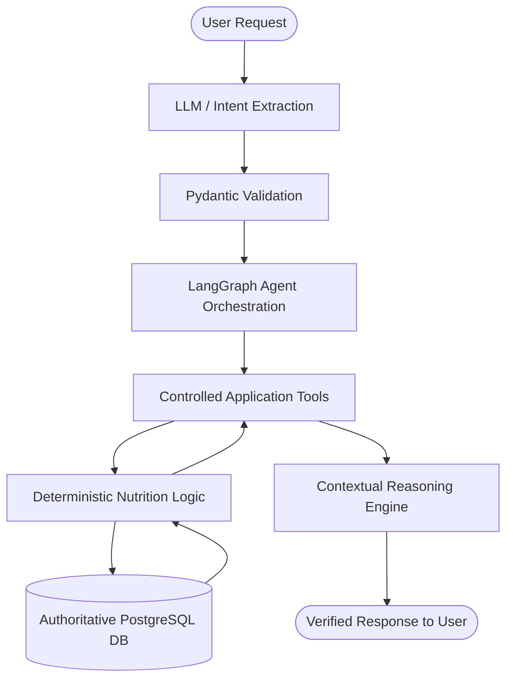

# Nutrino - AI Nutrition & Meal Planning Agent

[](https://www.python.org/)
[](https://fastapi.tiangolo.com/)
[](https://www.postgresql.org/)
[](https://www.sqlalchemy.org/)
[](LICENSE)

A production-grade, agentic AI nutrition and meal planning platform. Unlike simple chatbot wrappers, Nutrino strictly separates natural-language reasoning (orchestrated via LangGraph and local Ollama inference) from authoritative, deterministic application logic and nutritional calculations.

---

## 1. Project Overview

Nutrino allows users to converse naturally about their food intake (e.g., *"I had 2 dosas with sambar and one coffee for breakfast"* or *"What should I eat for dinner?"*). 

### Core Architectural Principle
**The LLM is NOT the source of truth for nutrition calculations or database mutations.**

- **AI Responsibilities**: Natural language understanding, intent recognition, structured food and entity extraction, tool selection, and contextual reasoning over application data.
- **Application Responsibilities**: Strict input validation (Pydantic), business rules, deterministic nutrition computations (macronutrients, micronutrients, target deltas), database operations, and user authorization.
- **Database Responsibilities**: The PostgreSQL database remains the single authoritative persistent state of the system.



---

## 2. Technology Stack

### Backend
- **Language**: Python 3.12
- **Framework**: FastAPI (asynchronous REST API, auto OpenAPI documentation)
- **Data Validation & Settings**: Pydantic v2 & Pydantic-Settings
- **ORM & Migrations**: SQLAlchemy 2.x & Alembic
- **Database**: PostgreSQL 16+
- **Security**: JWT Authentication (HS256) with passlib / bcrypt
- **Testing**: pytest, pytest-asyncio, httpx

### AI & Agent Layer (Phases 6–8)
- **Local LLM Inference**: Ollama (local server running on host)
- **Model**: Qwen 2.5 7B / Qwen 3 8B
- **Agent Orchestration**: LangGraph state graph with deterministic tool calling

### Frontend (Phase 10)
- React with Vite, JavaScript, Tailwind CSS, Axios

### Infrastructure
- Docker & Docker Compose
- Native Linux development compatibility

---

## 3. Architecture & Project Layout

```
Nutrino/
├── .env.example                # Environment variables template
├── .gitignore                  # Git ignore rules
├── docker-compose.yml          # PostgreSQL & Backend multi-container setup
├── README.md                   # Project documentation
├── alembic.ini                 # Root Alembic configuration
└── backend/
    ├── Dockerfile              # Production-grade Python 3.12 container
    ├── requirements.txt        # Pinned dependencies
    ├── alembic.ini             # Backend Alembic configuration
    ├── alembic/                # Alembic database migrations
    │   ├── env.py
    │   ├── script.py.mako
    │   └── versions/
    ├── app/
    │   ├── main.py             # FastAPI entry point & lifespan management
    │   ├── api/                # API routing
    │   │   └── v1/
    │   │       ├── api.py      # v1 router aggregator
    │   │       └── endpoints/
    │   │           └── health.py # Health, liveness, and readiness probes
    │   ├── config/             # Pydantic Settings configuration
    │   │   └── settings.py
    │   ├── database/           # Engine, sessions, Base model
    │   │   ├── base.py
    │   │   └── session.py
    │   ├── exceptions/         # Centralized error handling
    │   │   ├── base.py
    │   │   └── handlers.py
    │   ├── models/             # SQLAlchemy ORM models
    │   │   └── base.py
    │   └── schemas/            # Pydantic request/response schemas
    │       └── health.py
    └── tests/                  # Pytest automated test suite
        ├── conftest.py
        ├── test_database.py
        └── test_health.py
```

---

## 4. Current Implementation Status (Phases Roadmap)

- [x] **Phase 1: Foundation (Current)**
  - Project directory structure and Git setup
  - FastAPI application with lifespan management and CORS middleware
  - Pydantic Settings environment configuration (`.env.example`, `.env`)
  - PostgreSQL connectivity, engine connection pooling, and session management
  - SQLAlchemy 2.x declarative base and TimestampMixin
  - Alembic migrations configuration (`env.py`, `script.py.mako`)
  - Centralized exception handlers preventing stack trace leakage
  - Health check endpoints (`/api/v1/health`, `/live`, `/ready`)
  - Docker & Docker Compose configuration
  - Unit and integration tests with pytest (100% pass)
- [ ] **Phase 2: Authentication & User Management**
- [ ] **Phase 3: User Context (Profile & Goals)**
- [ ] **Phase 4: Nutrition Data & Food Items**
- [ ] **Phase 5: Meal System & Deterministic Aggregation**
- [ ] **Phase 6: Local LLM Integration (Ollama + Qwen)**
- [ ] **Phase 7: Controlled Agent Tools**
- [ ] **Phase 8: LangGraph Agent Orchestration**
- [ ] **Phase 9: Contextual & Proactive Recommendations**
- [ ] **Phase 10: React Frontend Dashboard**
- [ ] **Phase 11: End-to-End Evaluation & Testing**
- [ ] **Phase 12: CI/CD & Production Packaging**

---

## 5. Getting Started (Local Development)

### Prerequisites
- Linux OS (recommended: Ubuntu / Debian / Fedora)
- Python 3.12 (`pyenv` recommended)
- PostgreSQL 16+ or Docker

### Step 1: Clone and Set Up Virtual Environment

```bash
git clone <repo-url> Nutrino
cd Nutrino

# Create virtual environment using Python 3.12
python3.12 -m venv .venv
source .venv/bin/activate

# Upgrade pip and install dependencies
pip install --upgrade pip
pip install -r backend/requirements.txt
```

### Step 2: Environment Configuration

Copy the sample environment file:
```bash
cp .env.example .env
```

Ensure your `.env` contains your PostgreSQL credentials:
```ini
POSTGRES_SERVER=localhost
POSTGRES_PORT=5432
POSTGRES_USER=nutrino
POSTGRES_PASSWORD=nutrino_password
POSTGRES_DB=nutrino_db
SECRET_KEY=replace_with_a_secure_random_key_in_production
```

### Step 3: Run Database Migrations

```bash
PYTHONPATH=backend alembic upgrade head
```

### Step 4: Run the Development Server

```bash
PYTHONPATH=backend uvicorn app.main:app --reload --host 0.0.0.0 --port 8000
```

Access the interactive API documentation at:
- **Swagger UI**: [http://localhost:8000/api/v1/docs](http://localhost:8000/api/v1/docs)
- **ReDoc**: [http://localhost:8000/api/v1/redoc](http://localhost:8000/api/v1/redoc)
- **Health Check**: [http://localhost:8000/api/v1/health](http://localhost:8000/api/v1/health)

---

## 6. Running with Docker Compose

If using Docker:

```bash
docker compose up -d --build
```

This starts:
1. `nutrino_postgres`: PostgreSQL container on port `5432` with a persistent volume.
2. `nutrino_backend`: FastAPI backend on port `8000` with hot-reload volume mounting.

---

## 7. Running Tests

Execute the automated test suite with pytest:

```bash
PYTHONPATH=backend pytest -v
```

---

## 8. License

This project is licensed under the MIT License.
